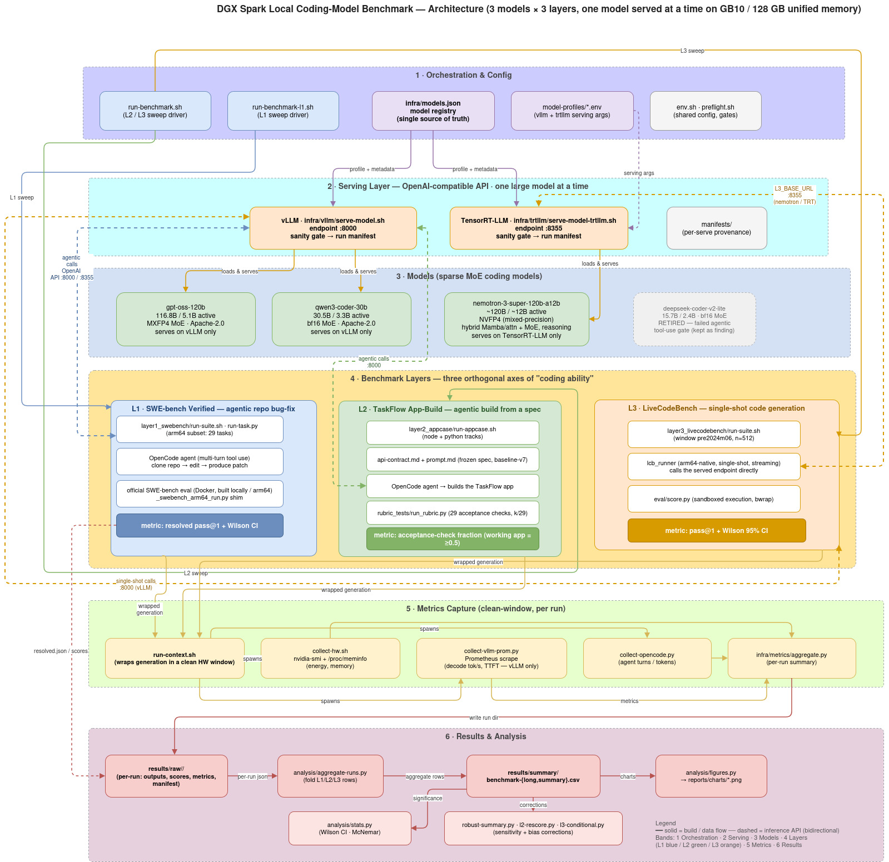

# DGX Spark Coding Model Benchmark

A reproducible **systems + methodology case study** of running local open-source coding
models through [OpenCode](https://opencode.ai) on a single **DGX Spark**. All three are
Mixture-of-Experts models spanning a sparsity spectrum; the study frames them as
**Nemotron (NVIDIA model, NVFP4) vs. Qwen (strong generalist, bf16) vs. gpt-oss
(external agentic anchor, MXFP4)** and reports, per configuration, both task success and
efficiency (tokens/joule, decode throughput, bandwidth pressure).

> **This is not a model-ranking paper.** Each arm couples a model with a specific quant,
> serving runtime, and tool scaffold (see the coupling table below), so scores describe a
> *deployment configuration on this box*, not intrinsic model quality. Because the two 4-bit
> MoEs run on **different runtimes** (Nemotron on TRT-LLM, gpt-oss on vLLM), the design
> **cannot** isolate a generic *FP4-on-Blackwell* effect — that would need a matched-model or
> factorial comparison. Serving feasibility and measurement pitfalls are the primary results.
> See [`docs/findings/2026-07-02-audit-verification-and-decision.md`](docs/findings/2026-07-02-audit-verification-and-decision.md).

| Model | Arch | Total / Active | Sparsity | Quant | License |
| --- | --- | --- | --- | --- | --- |
| gpt-oss-120b | MoE (128 exp, top-4) | 116.8B / 5.1B | 4.4% | MXFP4 | Apache-2.0 |
| Nemotron-3-Super-120B-A12B | MoE-hybrid (512 exp, top-22) | 120B / 12B | 10.0% | NVFP4 | NVIDIA Nemotron Open Model License |
| Qwen3-Coder-30B-A3B-Instruct | MoE (128 exp, top-8) | 30.5B / 3.3B | 10.8% | bf16 | Apache-2.0 |

> **Model identity is confounded with runtime, quant, and scaffold (disclosed).** No model
> serves on both runtimes on this box: **gpt-oss (MXFP4) and Qwen (bf16) run on vLLM;
> Nemotron (NVFP4 MIXED_PRECISION) runs on TRT-LLM only** (vLLM rejects its checkpoint). Where
> a model runs on vLLM, FP4 uses the **Marlin weight-only** kernel — GB10/SM121 has no native
> FP4 *compute* — so any storage/bandwidth "FP4 advantage" is not tensor-core math (disclosed in
> each manifest). Seed, temperature, KV-cache dtype, `max_num_seqs`, and OpenCode versions are
> held identical, but these coupled knobs mean each arm is a **configuration**, not a clean model
> contrast. Adding a 4th model = one entry in `infra/models.json` + a matching profile. Full
> coupling table: [`docs/HELP.md` §2](docs/HELP.md).

> **DeepSeek-Coder-V2-Lite was evaluated and retired** as model #3: it generates correct code
> but will not *autonomously* call tools, so it cannot drive the agent loop (it wrote nothing to
> disk while claiming success). gpt-oss replaced it after passing an explicit autonomous-tool-use
> gate. The case is documented — agentic competence ≠ code-generation competence — in
> [`docs/findings/2026-06-24-deepseek-v2-lite-agentic-tool-use.md`](docs/findings/2026-06-24-deepseek-v2-lite-agentic-tool-use.md).

The study spans three layers (SWE-bench subset, a full-stack app build, and LiveCodeBench).
In Layer 2 each model builds the same realistic full-stack app (**TaskFlow Local**) from the
same frozen specification, across two backend tracks (Node.js and Python/FastAPI). This repo
collects the metrics, scores the runs with automated checks, and produces a report meant
for publication (GitHub + arXiv). See [`docs/HELP.md`](docs/HELP.md) for the canonical,
end-to-end description of the protocol.

## Architecture



The diagram traces one run end-to-end through six bands, all on a single DGX Spark
(GB10, 128 GB unified memory) serving **one large model at a time**:

1. **Orchestration & Config** — sweep drivers (`run-benchmark.sh` for L2/L3,
   `run-benchmark-l1.sh` for L1) read `infra/models.json` (the single source of truth) plus
   per-model serving profiles, and hand each arm its model + serving args.
2. **Serving Layer** — the selected model comes up behind an OpenAI-compatible API with a
   sanity gate and a per-serve reproducibility manifest: **vLLM on `:8000`** (gpt-oss, Qwen)
   or **TensorRT-LLM on `:8355`** (Nemotron, whose MIXED_PRECISION NVFP4 checkpoint vLLM rejects).
3. **Models** — the three sparse-MoE coding models (gpt-oss-120b MXFP4, qwen3-coder-30b bf16,
   nemotron-3-super-120b-a12b NVFP4), plus retired DeepSeek-Coder-V2-Lite kept as a finding.
4. **Benchmark Layers** — three orthogonal axes of "coding ability": **L1** SWE-bench Verified
   agentic bug-fix (resolved pass@1), **L2** TaskFlow app-build from a frozen spec (29-check
   acceptance fraction), **L3** LiveCodeBench single-shot generation (pass@1 + Wilson CI). L1/L2
   drive the agent through OpenCode; L3 calls the endpoint directly.
5. **Metrics Capture** — `run-context.sh` wraps each generation in a clean hardware window and
   spawns three synchronized collectors (hardware energy/memory, vLLM Prometheus decode-throughput,
   OpenCode agent turns/tokens), folded into a per-run summary by `infra/metrics/aggregate.py`.
6. **Results & Analysis** — per-run outputs land in `results/raw/`, are aggregated to
   `results/summary/` long/summary CSVs, then run through statistics (Wilson/McNemar), robustness
   and bias corrections, and figure generation.

## Two-repo design

| Repo | Driven by | Role |
| --- | --- | --- |
| **dgx-spark-coding-model-benchmark** (this repo) | an AI coding assistant | Spec master copy, metrics, scoring, charts, report |
| **taskflow-local-app-benchmark** | OpenCode | Workspace where each model builds the app (one branch per run) |

The model-generated app code lives only in the app repo. **This repo never edits that
code** — doing so would contaminate the benchmark. an AI coding assistant is not part of what is
measured; it only builds tooling and writes the report.

## Layout

```text
infra/vllm/        Sequential model serving (:8000) + per-run config manifests
infra/metrics/     Three-source metric collection (hardware, vLLM, OpenCode) + aggregator
layer1_swebench/   Layer 1: ARM64-buildable SWE-bench Verified subset (29 tasks)
layer2_appcase/    Layer 2: TaskFlow app build + 29-check API acceptance tests
layer3_livecodebench/ Layer 3: LiveCodeBench single-shot code generation (pass@1)
analysis/          Statistics (Wilson/bootstrap/McNemar, power analysis) + published figures
manifests/         Run manifests (all configs/versions) for arXiv reproducibility
results/raw/       Per-task metrics (<model>-<layer>-<task>-<repeat>/)
results/summary/   Aggregated long-format CSV + summary tables
benchmark-spec/    Frozen spec (master): requirements, expected output, run protocol, rubric
prompts/           Master build/review prompts
docs/              methodology.md, publishing-plan.md, design-workflow/specs/ (design)
```

See `docs/design-workflow/specs/2026-06-24-dgx-spark-coding-benchmark-harness-design.md`
for the full design, and `infra/metrics/README.md` for the metrics layer.

## Three measurement layers

- **Layer 1 — SWE-bench Verified (disclosed 29-task ARM64-buildable subset):** agentic bug
  fix, scored automatically as resolved pass@1 on the subset (not full SWE-bench Verified).
  See `layer1_swebench/`.
- **Layer 2 — TaskFlow app build:** each model builds **TaskFlow Local** to a pinned API
  contract, scored by the **TaskFlow API acceptance-check fraction (k/29)** — the fraction of
  29 equally-weighted HTTP contract assertions that pass. This is an API-acceptance signal,
  **not** a full-stack app-quality score (see the coverage matrix in
  [`layer2_appcase/COVERAGE.md`](layer2_appcase/COVERAGE.md)). Reported figures are the
  **contract-visible `baseline-v7` rerun**: an earlier lineage break (`baseline-v4`→`v6`) had
  dropped `api-contract.md` from the run baseline, so 4 checks were structurally unreachable
  (finding **C1**); results are dual-reported as k/29 and the C1-rescored k/25 (25 reachable
  checks) — see [`docs/findings/2026-07-03-l2-contract-invisible.md`](docs/findings/2026-07-03-l2-contract-invisible.md).
  See `layer2_appcase/`.
- **Layer 3 — LiveCodeBench:** single-shot code generation, scored as pass@1 with Wilson
  95% CI on a fixed pre-2024-06 window (512 problems). Non-agentic. See `layer3_livecodebench/`.

L1/L2 are wrapped in three synchronized metric sources (hardware, vLLM inference, OpenCode
accounting); L3 has hardware metrics only. See `infra/metrics/README.md`.

## Quickstart

```bash
# 0) one-time: python deps for analysis + Layer 1 (metrics layer is stdlib-only)
infra/setup-python-env.sh && source .venv/bin/activate

# 1) serve a model on :8000 (writes a reproducibility manifest); sequential — one at a time
infra/vllm/serve-model.sh qwen3-coder-30b

# 2a) LAYER 2: build TaskFlow Local + capture metrics + score, N repeats (resumable)
layer2_appcase/run-appcase.sh qwen3-coder-30b node 3

# 2b) LAYER 1: verify an ARM64 subset, then run it (resumable)
python3 layer1_swebench/select-arm64-subset.py --verify --limit 50
layer1_swebench/run-suite.sh qwen3-coder-30b 3

# 3) swap model and repeat 2a/2b. NOTE: nemotron-super serves on TRT-LLM only (not vLLM);
#    vLLM rejects its MIXED_PRECISION NVFP4 checkpoint. See docs/HELP.md §2.
infra/trtllm/serve-model-trtllm.sh nemotron-super
layer2_appcase/run-appcase.sh nemotron-super node 3

# 4) aggregate + statistics + figures
python3 analysis/aggregate-runs.py
python3 analysis/stats.py --long results/summary/benchmark-long.csv
python3 analysis/figures.py
# failure-aware re-summary: typed L1 outcomes (infra vs model failures), robust
# median/IQR energy with runaway sensitivity, full L2 k/29 distributions
python3 analysis/robust-summary.py
```

### Measure a single OpenCode task directly

```bash
infra/metrics/run-context.sh <run-id> -- \
  opencode run --format json -m vllm-local/qwen3-coder-30b --dir <repo> "<prompt>"
# -> results/raw/<run-id>/run-summary.json
```

## Status

| Layer | State |
| --- | --- |
| infra/vllm + infra/trtllm + infra/metrics | **built & validated** against live vLLM + TRT-LLM endpoints |
| Layer 1 (SWE-bench 29-task subset) | **executed** — gpt-oss 11/29, qwen 7/29, nemotron 6/29 (see `docs/findings/2026-06-29-full-matrix-results.md`) |
| Layer 2 (29-check acceptance runner) | **executed** on the contract-visible `baseline-v7` rerun (C1 fix) — node N=20 gpt-oss **0.724** (16/20 working apps), qwen 0.178 (3/20); python N=8; nemotron N=4; catches RBAC bypass. Dual-reported k/29 + C1-rescored k/25 in [`results/summary/l2-rescore-25.csv`](results/summary/l2-rescore-25.csv) |
| Layer 3 (LiveCodeBench) | **executed** — n=512 pass@1 with Wilson CI, all three models |
| analysis (stats/figures) | **built & validated** (stats `--selftest` passes) |

See [`docs/HELP.md`](docs/HELP.md) for the canonical protocol, `docs/methodology.md` for
fairness controls, and `docs/publishing-plan.md` for publication. The reframing decision and
external-audit verification are in
[`docs/findings/2026-07-02-audit-verification-and-decision.md`](docs/findings/2026-07-02-audit-verification-and-decision.md).

## AI usage

Parts of this repository (harness code, prose, and several analysis/audit documents) were
produced with AI assistance. See [`docs/AI_USAGE.md`](docs/AI_USAGE.md) for a transparent
account of what was AI-generated and how it was human-verified.
