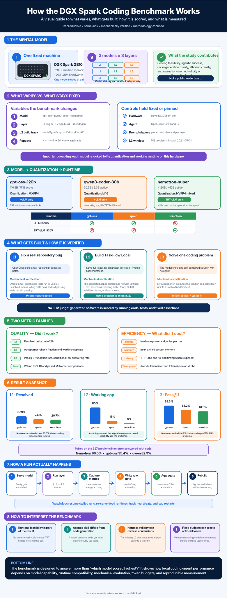

# Benchmark Help — How the Whole Thing Works

A plain-language guide to the DGX Spark coding-model benchmark: what it varies, what it
builds, how it scores, and what it measures. Read this first if you want the mental model;
follow the links for the deep detail.

- **Repo:** <https://github.com/mani-mal/dgx-spark-coding-model-benchmark>
- **One-page technical map:** [`docs/BENCHMARK_OVERVIEW.md`](BENCHMARK_OVERVIEW.md)
- **Methodology & fairness controls:** [`docs/methodology.md`](methodology.md)
- **Every decision, dated:** [`docs/findings/`](findings/)
- **Raw per-run data:** `results/raw/<run-id>/` · **Aggregated:** `results/summary/benchmark-{long,summary}.csv`

---

## 1. What this benchmark is

A **reproducible, methodology-focused** comparison of local open-source coding models on a
**single [DGX Spark](https://www.nvidia.com/en-us/products/workstations/dgx-spark/)** (GB10,
Grace Blackwell). The contribution is *serving/efficiency reality + evaluation methodology on
consumer Grace Blackwell* — **not** a public leaderboard. All numbers are valid **relative,
same-box** comparisons; they are deliberately not comparable to public leaderboards (different
config, hardware, and contamination handling).

Everything is driven through the [OpenCode](https://opencode.ai) coding agent talking to a
locally-served model over an OpenAI-compatible API.

---

## 2. The axes (what varies, what's fixed)

The study is a **3 models × 3 layers** grid. Some knobs are *locked together* — that coupling
is deliberate and is itself part of the findings.

| Axis | Values | Free knob? | Notes |
|---|---|---|---|
| **Hardware** | DGX Spark GB10 (aarch64, sm_121a, 128 GB unified LPDDR5x, ~273 GB/s) | Fixed | One box; **one model served at a time** |
| **Agent driver** | [OpenCode](https://opencode.ai) | Fixed | Drives L1 & L2 (agentic) only; L3 has no agent |
| **Model** | gpt-oss-120b · qwen3-coder-30b · nemotron-super | **Yes** | The primary independent variable |
| **Quantization** | MXFP4 · bf16 · NVFP4 (mixed) | Locked to model | Each model ships one quant; quant effect is confounded with model effect (disclosed) |
| **Container / runtime** | [vLLM](https://github.com/vllm-project/vllm) · [TensorRT-LLM](https://github.com/NVIDIA/TensorRT-LLM) | Locked to model | **No model serves on both** on this box — a same-model runtime bridge is impossible here (a headline finding) |
| **Layer** | L1 · L2 · L3 | **Yes** | Three orthogonal definitions of "coding ability" |
| **Build track** | node · python | **Yes — L2 only** | An L2 sub-axis; L1 and L3 have no track |
| **N (repeats)** | 1 → 8 → 20 | **Yes** | vLLM continuous batching is non-deterministic even at seed 0, so cells are repeated |
| **Contamination window** | `contest_date ≤ 2024-05-31` (512 problems) | Fixed | L3 only; *bounds* training-cutoff exposure asymmetry (equal opportunity ≠ equal exposure — does not balance/cancel contamination) |

### Model → quant → runtime coupling

| Model | HF card | Quant | Serves on | Why locked |
|---|---|---|---|---|
| **gpt-oss-120b** (116.8B / 5.1B) | [openai/gpt-oss-120b](https://huggingface.co/openai/gpt-oss-120b) | MXFP4 | **vLLM only** | MXFP4 MoE autotunes on TRT but requests deadlock at the executor |
| **qwen3-coder-30b** (30.5B / 3.3B) | [Qwen/Qwen3-Coder-30B-A3B-Instruct](https://huggingface.co/Qwen/Qwen3-Coder-30B-A3B-Instruct) | bf16 | **vLLM only** | bf16 MoE has no working sm_121a TRT kernel |
| **nemotron-super** (~120B / ~12B, hybrid Mamba/attn + MoE, reasoning) | [nvidia/NVIDIA-Nemotron-3-Super-120B-A12B-NVFP4](https://huggingface.co/nvidia/NVIDIA-Nemotron-3-Super-120B-A12B-NVFP4) | NVFP4 (MIXED_PRECISION) | **TRT-LLM only** | vLLM rejects its MIXED_PRECISION checkpoint |

> **Serving feasibility is a result, not just setup.** No single model serves on both runtimes,
> so a same-model vLLM-vs-TRT comparison can't be done on this box. Details:
> [`2026-06-25-nemotron-super-vllm-mixed-precision.md`](findings/2026-06-25-nemotron-super-vllm-mixed-precision.md),
> [`2026-06-29-qwen-trt-moe-blackwell-blocker.md`](findings/2026-06-29-qwen-trt-moe-blackwell-blocker.md),
> [`2026-06-29-gpt-oss-trt-blocker.md`](findings/2026-06-29-gpt-oss-trt-blocker.md).
>
> Model registry (single source of truth): [`infra/models.json`](../infra/models.json). Adding a
> 4th model = one entry there + a matching `infra/{vllm,trtllm}/model-profiles/<profile>.env`.

---

## 3. The three layers (orthogonal axes of "coding ability")

| Layer | What the model does | Metric | Agentic? | Upstream |
|---|---|---|---|---|
| **L1** | Fix a real bug in a real repo (29-task arm64 subset) | resolved **pass@1** | Yes (multi-turn tool use) | [SWE-bench Verified](https://www.swebench.com/) ([repo](https://github.com/SWE-bench/SWE-bench)) |
| **L2** | Build a whole full-stack app ("TaskFlow Local") from a spec | **acceptance-check fraction** (k/29; "working app" = ≥ 0.5) — contract-visible after the C1 rerun | Yes (multi-turn tool use) | Custom (this repo) |
| **L3** | Solve one self-contained problem, single shot | **pass@1** + Wilson 95% CI | No (single generation) | [LiveCodeBench](https://livecodebench.github.io/) ([repo](https://github.com/LiveCodeBench/LiveCodeBench)) |

The thesis: **L1/L2 measure agentic tool-use; L3 measures raw code generation.** They are
deliberately orthogonal, so "good at codegen ≠ good at driving an agent" becomes empirical.
(DeepSeek-Coder-V2-Lite — a competent coder that would not autonomously call tools — is the
retired proof; see [`2026-06-24-deepseek-v2-lite-agentic-tool-use.md`](findings/2026-06-24-deepseek-v2-lite-agentic-tool-use.md).)

L1 runs on a **29-task arm64 subset** because SWE-bench Verified images are x86-only.

---

## 4. What software gets built, and how generation is verified

Across all layers, **"what the model generated" is verified mechanically by running code** —
never by subjective or LLM grading.

### L2 — the node/python tracks

Both tracks build the **same application, "TaskFlow Local"**: a small but realistic full-stack
task manager — bearer-token auth with two seeded users, projects with role-based access control
(RBAC), tasks (status/priority/filter/search), comments, a TypeScript frontend with pages, and
local SQLite persistence. The **only** difference between tracks is the backend language:

- **node track** → `apps/node-track/backend` (Node/TypeScript, `npm run start`) + TS frontend
- **python track** → `apps/python-track/backend` (FastAPI, `uvicorn app.main:app`) + TS frontend

Every build must implement a **frozen API contract** ([`layer2_appcase/api-contract.md`](../layer2_appcase/api-contract.md))
exactly: backend on `127.0.0.1:4000`, `GET /api/health → {"status":"ok"}`, specified status
codes and JSON shapes. The contract lives in the app workspace as of app-repo tag `baseline-v7`
(it was missing from `baseline-v6` — finding C1, see §4 step 3). The build prompt is pinned and
identical for every model:
[`layer2_appcase/prompt.md`](../layer2_appcase/prompt.md).

**How it's auto-verified** — [`layer2_appcase/rubric_tests/run_rubric.py`](../layer2_appcase/rubric_tests/run_rubric.py),
run identically for every model/track:

1. **Install / start / build** — `npm ci || npm install` (node) or `pip install -r requirements.txt`
   (python), start the backend, build the frontend. Each is a scored check (build success,
   lockfile present, backend boots).
2. **Hit the running API over HTTP** with ~29 fixed assertions derived from the contract, e.g.:
   `/api/health` returns ok; admin login returns a token with `role=admin`; **user objects never
   leak a password field** (security); bad creds → 401; `/auth/me` without token → 401, with token
   → 200; a member is **403** on project create (RBAC); admin create/list/get/edit/archive project;
   validation (missing name → 400); task create/list/get/status-update/filter/search/delete;
   comments add/list.
3. **Score = the TaskFlow API acceptance-check fraction** (k/29): the fraction of the 29
   equally-weighted checks that pass, against a **fixed 29-check canonical denominator** so a
   non-booting backend scores k/29 (comparable across runs), not k/2. Written to
   `rubric-score.json`. **Note (C1, resolved):** in the *original* sweep, `api-contract.md` was
   missing from the workspace (the runner checked out `baseline-v6`, which never contained it), so
   four contract-only checks scored 0 everywhere. This was fixed by re-running L2 with the contract
   restored (app-repo `baseline-v7`) — the numbers in §6 are the corrected, contract-visible ones.
   A k/25 "reachable-checks" dual-report (`pass_rate_25`) is retained as a guard and for the
   archived pre-contract data. See `layer2_appcase/COVERAGE.md`,
   `docs/findings/2026-07-03-l2-contract-invisible.md`, and the rerun/ablation writeup
   `docs/findings/2026-07-03-l2-rerun-with-contract-decision.md`.

No model judges another model — it's pure request/response assertion against a pinned contract.

### L1 — official SWE-bench harness

OpenCode produces a patch; it's applied to the target repo, then the repo's **real gold test
suite** (FAIL_TO_PASS / PASS_TO_PASS) runs in Docker. "Resolved" = the failing tests now pass and
previously-passing ones still pass. Ground truth is the project's own tests. arm64 enablement
detail: [`2026-06-26-layer1-arm64-enablement.md`](findings/2026-06-26-layer1-arm64-enablement.md).

### L3 — LiveCodeBench execution

The model emits a single solution; `lcb_runner` **runs it against LiveCodeBench's hidden unit
tests** → pass@1. `run-suite.sh` attempts a `bwrap` sandbox first, but **this kernel (GB10,
aarch64) blocks unprivileged user namespaces, so bwrap cannot run and grading falls back to
LiveCodeBench's stock subprocess isolation** (`--timeout 6`) — the same unsandboxed harness the
public LCB leaderboard uses; the deviation is disclosed in `layer3_livecodebench/coverage.md`
("sandbox deviation, disclosed"). A guard extracts code even when reasoning models return
`content=None` on truncation. Integration scope:
[`2026-06-29-livecodebench-integration-scope.md`](findings/2026-06-29-livecodebench-integration-scope.md).

---

## 5. What metrics are captured

Two parallel families: **quality** (did it work) and **efficiency** (what did it cost).

### Quality
- **L1:** resolved pass@1 (count / 29).
- **L2:** rubric pass rate (0–1, k/29, contract-visible after the C1 rerun); "working app" = ≥ 0.5;
  plus a Bernoulli "produces a working app" rate with **Wilson 95% CI** across N repeats. (The
  *pre-contract* sweep also showed low-N ranking instability — a flip-table across N=1→8→20 — but
  those flips were between two mis-measured scores and are now subsumed by the C1 ablation; see §6.)
- **L3:** pass@1 with **Wilson 95% CI**; plus **empty/truncated rate** and **conditional-on-answering
  pass rate** (critical for verbose reasoning models — see §6).
- **Significance:** McNemar's test for paired model comparisons ([`analysis/stats.py`](../analysis/stats.py),
  stdlib, `--selftest` passes).

### Efficiency (per run, when available)
- **Hardware energy & memory** — from `nvidia-smi` + `/proc/meminfo` for **all** runs (unified
  memory ⇒ `nvidia-smi` memory is N/A, so memory comes from `/proc/meminfo`).
- **Throughput** — decode tok/s, TTFT, tokens/joule, generated-token counts — from **vLLM
  Prometheus**. Example (L1): gpt-oss ~26.9 tok/s, qwen ~19.7 tok/s.
- **TRT-LLM exposes no Prometheus** → nemotron has hardware energy/memory but **no decode-tok/s /
  TTFT** (blank, disclosed). This is why nemotron L3 could be run 8-way parallel with no metric loss.

### Fields recorded per run
`Model · Runtime · Context length · Prompt size · Time-to-first-token · Tokens/sec · Peak system
memory · Tool-calling worked? · Files edited correctly? · Tests passed? · Notes` — aggregated by
[`analysis/aggregate-runs.py`](../analysis/aggregate-runs.py) into
`results/summary/benchmark-{long,summary}.csv`; charts via [`analysis/figures.py`](../analysis/figures.py).

---

## 6. Final results (same box; relative comparison)

### L1 — disclosed 29-task arm64 subset (N=1 pass@1) — NOT SWE-bench Verified
"Raw" counts every task in the denominator; "model-valid" excludes operational outcomes
(watchdog kills, DNS-dropped clones, missing measurement) that are not clean model failures.
Only Nemotron has any — 8 infra-missing (incl. 4 DNS-dropped sympy) + 1 watchdog kill — so its
raw rate understates it. Full taxonomy: `python3 analysis/robust-summary.py` →
`results/summary/l1-run-ledger.csv`.

| Model | Raw (k/29) | Model-valid (resolved / valid attempts) |
|---|---|---|
| gpt-oss-120b (vLLM) | **37.9%** (11/29) | 37.9% (11/29) |
| qwen3-coder-30b (vLLM) | 24.1% (7/29) | 24.1% (7/29) |
| nemotron-super (TRT) | 20.7% (6/29) | **30.0% (6/20)** |

### L2 — App-build acceptance-check fraction (contract-visible; corrected for C1)
The first L2 sweep ran under a harness bug (the frozen contract was missing from the workspace —
finding C1). After restoring it (app-repo `baseline-v7`) and re-running the vLLM models, the
corrected result (mean k/29; k/25 nearly equals k/29 now that the contract checks are reachable):

| Model | node (N=20) | python (N=8) |
|---|---|---|
| gpt-oss-120b (vLLM) | **0.724** (working 16/20 = 80% [58,92]) | 0.069 (0/8 working) |
| qwen3-coder-30b (vLLM) | 0.178 (working 3/20 = 15% [5,36]) | 0.004 (0/8) |
| nemotron-super (TRT)\* | 0.009 (N=4) | 0.000 (N=4) |

\*nemotron was **not** rerun (TRT-only, floor-saturated; a visible contract cannot help a model
whose backend almost never boots). Its rows remain the contract-invisible measurement.

**The bug had inverted the L2 conclusion.** Under it, gpt-oss (0.252) and qwen (0.155) looked
*statistically indistinguishable*; corrected, gpt-oss (**80%** working apps) clearly and
significantly beats qwen (**15%**) on node (non-overlapping Wilson intervals). The contract helped
only where a model could build a booting app — **gpt-oss node jumped 2.9×** (the four contract-only
checks went 0→48 passes) — while qwen (capability-limited) and both python tracks (floored) barely
moved. Full before/after ablation: `results/summary/l2-ablation-contract.csv` and
`docs/findings/2026-07-03-l2-rerun-with-contract-decision.md`.

**python floors for both models** (a real node↔python asymmetry, not a contract artifact). Report
the Bernoulli working-app rate + Wilson CI, never a single-N mean.

### L3 — LiveCodeBench (pre2024m06 window, n=512, pass@1)
| Model | pass@1 | Wilson 95% CI | empty/truncated |
|---|---|---|---|
| gpt-oss-120b (vLLM) | **89.3%** | [86.3, 91.7] | ~1–2% |
| qwen3-coder-30b (vLLM) | 68.2% | [64.0, 72.1] | ~0% |
| nemotron-super (TRT) | 61.3% | [57.0, 65.4] | **27.9% (143/512)** |

> **Critical L3 nuance:** nemotron's last place is largely a **fixed-token-budget artifact, not
> capability**. Its verbose reasoning exhausted the shared 8192-token budget on **185/512**
> problems (143 empty + 42 output-with-no-extractable-code), which scored as fails. Truncation is
> strongly difficulty-correlated: no-code rate **easy 14.3%, medium 34.3%, hard 71.5%** — so the
> answered subset is much easier than the full set, and comparing a conditional rate to other
> models' full-512 rates is invalid. **Paired correctly** (all models on the **327** problems
> nemotron answered with code): **nemotron 96.0% (314/327), gpt-oss 95.4% (312/327), qwen 82.3%
> (269/327)** — the artifact reading survives and strengthens (nemotron ≈ gpt-oss when it answers).
> Report raw pass@1 **and** truncation rate **and** the paired conditional rate.
> ([`2026-07-01-nemotron-trt-mtp-wedge.md`](findings/2026-07-01-nemotron-trt-mtp-wedge.md),
> [`2026-07-03-l3-conditional-selection-bias.md`](findings/2026-07-03-l3-conditional-selection-bias.md);
> data `results/summary/l3-conditional-analysis.csv`.)

**Consistent story across layers:** gpt-oss ≥ qwen ≥ nemotron on raw scores, but every gap is
either statistically weak (L1/L2) or budget-confounded (L3 nemotron). The paper's point is about
**how you measure**, not a clean capability ranking.

---

## 7. Shared config & fairness controls

- **Held identical across the vLLM models** (gpt-oss, qwen): seed 0, decode temperature 0.2,
  KV-cache dtype auto, `max_num_seqs=1`, and OpenCode/vLLM versions. Model identity is the intended
  variable. **TRT/nemotron does not map 1:1** — it ran `max_batch_size` 8 (L1/L2) / 4 (L3) and FP8
  KV cache, not `max_num_seqs=1` / auto KV. Quality metrics are model-driven and comparable;
  throughput/energy/latency are runtime-dependent and are **not** a controlled cross-runtime
  comparison (M17; see `infra/models.json` `trtllm_deviation_note`).
- **L3 decode (constant for cross-layer comparability):** seed 0, temp 0.2, top_p 0.95, n=1,
  **max_tokens 8192**, unquantized KV (TRT nemotron uses FP8 KV — a runtime default, disclosed).
  Truncated-as-fail is deliberate and disclosed.
- **Necessarily different (disclosed confounds):** `max_model_len` and `gpu_memory_utilization`
  differ per model under the 128 GB unified-memory limit.
- **FP4 caveat:** GB10/sm_121a has **no native FP4 compute path** — both FP4 models run through
  **weight-only (Marlin) kernels**, so any "FP4 advantage" is storage/bandwidth, not tensor-core
  math (disclosed in each run manifest).
- **Contamination is possible, not balanced or free:** L3 window = `contest_date ≤ 2024-05-31`
  (before gpt-oss's June-2024 cutoff, the earliest of the three) = 512 problems. Every model *could*
  have seen it, which bounds exposure asymmetry, but equal opportunity ≠ equal exposure (corpora and
  dedup differ), so this does **not** "cancel" — report it as a contamination-possible window with a
  sensitivity analysis; not leaderboard-comparable.

---

## 8. How a run actually happens

1. **Serve one model:** `infra/vllm/serve-model.sh <profile>` (vLLM :8000) or
   `infra/trtllm/serve-model-trtllm.sh <profile>` (TRT-LLM :8355). Both sanity-gate (text
   coherence + autonomous tool-use) and write a run manifest.
2. **Run a layer:** `layer1_swebench/run-suite.sh`, `layer2_appcase/run-appcase.sh`, or
   `layer3_livecodebench/run-suite.sh` — each wraps generation in `infra/metrics/run-context.sh`
   (clean-window hardware/energy capture) and writes `results/raw/<run-id>/`.
3. **Aggregate:** `analysis/aggregate-runs.py` → `results/summary/benchmark-{long,summary}.csv`;
   `analysis/figures.py` → charts; stats (Wilson CI, McNemar) in `analysis/stats.py`.
- **Endpoint override:** L3 uses `L3_BASE_URL` to point at :8355 for TRT (env.sh otherwise forces :8000).
- **Watchdogs:** long unattended runs are guarded by `layer3_livecodebench/l3-watchdog*.sh` —
  auto-resume from `--use_cache` on crash/stall, re-serve on runtime death, heartbeat + restart cap.

---

## 9. Reference links

**This project**
- Repo: <https://github.com/mani-mal/dgx-spark-coding-model-benchmark>
- Technical overview: [`docs/BENCHMARK_OVERVIEW.md`](BENCHMARK_OVERVIEW.md) · Methodology: [`docs/methodology.md`](methodology.md)
- Findings index: [`docs/findings/`](findings/) · Full L1/L2 capstone: [`2026-06-29-full-matrix-results.md`](findings/2026-06-29-full-matrix-results.md)

**Models**
- [openai/gpt-oss-120b](https://huggingface.co/openai/gpt-oss-120b)
- [Qwen/Qwen3-Coder-30B-A3B-Instruct](https://huggingface.co/Qwen/Qwen3-Coder-30B-A3B-Instruct)
- [nvidia/NVIDIA-Nemotron-3-Super-120B-A12B-NVFP4](https://huggingface.co/nvidia/NVIDIA-Nemotron-3-Super-120B-A12B-NVFP4)

**Runtimes & agent**
- [vLLM](https://github.com/vllm-project/vllm) · [TensorRT-LLM](https://github.com/NVIDIA/TensorRT-LLM) · [OpenCode](https://opencode.ai)

**Benchmarks**
- [SWE-bench](https://www.swebench.com/) ([repo](https://github.com/SWE-bench/SWE-bench)) · [LiveCodeBench](https://livecodebench.github.io/) ([repo](https://github.com/LiveCodeBench/LiveCodeBench))

**Hardware & external context**
- [NVIDIA DGX Spark](https://www.nvidia.com/en-us/products/workstations/dgx-spark/) · [DGX Spark playbooks](https://github.com/NVIDIA/dgx-spark-playbooks)
- Nemotron-on-DGX-Spark write-up (Saiyam Pathak): <https://saiyampathak.medium.com/heres-what-i-learned-about-nemotron-3-super-i-ran-a-120b-parameter-model-on-nvidia-dgx-spark-fc5b3be12ae1>
