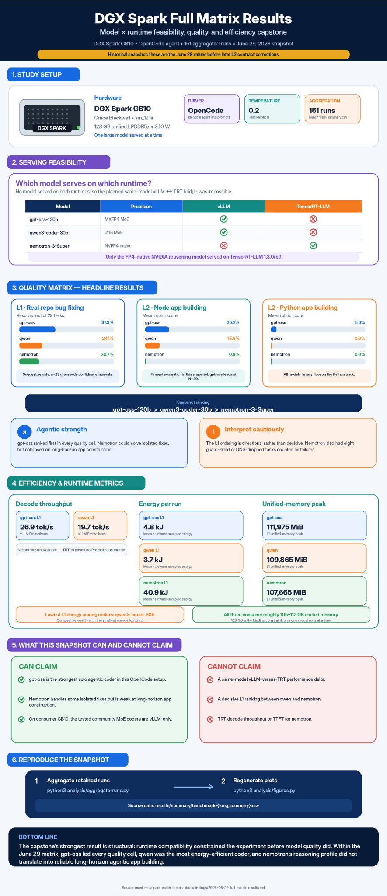

# DGX Spark coding-model benchmark — full model × runtime matrix (capstone)

**Date:** 2026-06-29
**Hardware:** DGX Spark GB10 (Grace Blackwell, sm_121a, 128 GB unified LPDDR5x, 240 W)
**Driver:** OpenCode agent, identical prompts, temperature 0.2 held identical across all models.
**Aggregation:** `analysis/aggregate-runs.py` → `results/summary/benchmark-summary.csv` (151 runs).

This doc consolidates the whole study. Quality ranking, fairness review, and the PinchBench
reconciliation live in the companion findings (linked at the end); here is the complete table plus
the **serving-feasibility** result, which is itself a primary finding.



---

## 1. Serving feasibility — which model serves on which runtime

On this box, **no single model serves on both runtimes**, so the originally-planned same-model
vLLM↔TRT-LLM "bridge" is **not achievable**. This is a substantive infrastructure result, not a
gap in effort (6+ serve configurations were exhausted per blocked model).

| Model | precision | vLLM | TensorRT-LLM 1.3.0rc9 | Blocker doc |
|---|---|:---:|:---:|---|
| nemotron-3-Super-120B | NVFP4 (native) | ✗ can't load MIXED_PRECISION ckpt | **✓ serves** | — |
| qwen3-coder-30B-A3B | bf16 MoE | **✓ serves** | ✗ MoE kernel (no sm_121a path) | `2026-06-29-qwen-trt-moe-blackwell-blocker.md` |
| gpt-oss-120B | MXFP4 MoE | **✓ serves** | ✗ executor-scheduling deadlock | `2026-06-29-gpt-oss-trt-blocker.md` |

**Takeaway:** under TensorRT-LLM 1.3.0rc9 on consumer GB10, only the **FP4-native NVIDIA reasoning
model** serves. Community MoE *coders* run only under vLLM — qwen's bf16 MoE has no working
Blackwell-sm_121a kernel (cutlass SM80 deadlock / Triton `.tile::gather4` ptxas crash / VANILLA
graph-capture + executor deadlock), and gpt-oss's MXFP4 MoE *autotunes* but its live requests
deadlock at the server→executor RPC handoff (zero generation iterations, GPU idle).

Consequence: **cross-model quality is compared on the uniform vLLM harness** (qwen vs gpt-oss);
nemotron's quality is measured on TRT-LLM (its only runtime). Cross-runtime *efficiency* numbers
(below) are therefore confounded by runtime and must not be read as same-model runtime deltas.

---

## 2. Quality matrix (the headline)

| Model (runtime) | L1 resolved (n=29) | L2 node rubric (n) | L2 python rubric (n) |
|---|---:|---:|---:|
| **gpt-oss-120b** (vLLM) | **37.9 %** | **25.2 %** (20) | **5.6 %** (8) |
| qwen3-coder-30b (vLLM) | 24.1 % | 15.5 % (20) | 0.0 % (8) |
| nemotron-3-Super (TRT) | 20.7 % | 0.9 % (4) | 0.0 % (4) |

- **gpt-oss-120b is #1 on every cell.** qwen3-coder-30b is the mid-tier coder; nemotron-3-Super
  lands isolated single-file fixes (L1 20.7 %) but **collapses on long-horizon app-building**
  (L2 node 0.9 %), the documented reasoning-model split.
- **L1 caveat (n=29, ~±15 pp 95 % CI):** gpt-oss > qwen ≈ nemotron is *suggestive* on L1; the
  **firm separation is L2 node** (n=20 for the vLLM coders), where gpt-oss (25 %) clearly leads.
- **nemotron L1 = 6/29 = 20.7 %** (exact: django-10880/10914, matplotlib-13989, flask-5014,
  requests-1142/1766). The 8 guard-killed/DNS-dropped tasks are resolved=0 and **are counted** in
  the denominator (the aggregator was fixed to count outcome-only runs; excluding them had inflated
  the rate to 28.6 %).
- **nemotron L2 at N=4** (vs N=20 for vLLM coders): floor-saturated (peak 1/29 of the rubric), so a
  larger N buys nothing — see `2026-06-27-nemotron-layer2-variance.md`.

---

## 3. Efficiency / runtime metrics (per layer, means)

| Model (runtime) | layer | decode tok/s | energy/run (J) | unified-mem peak (MiB) | TTFT p50 (s) |
|---|---|---:|---:|---:|---:|
| gpt-oss-120b (vLLM) | L1 | 26.9 | 4 844 | 111 975 | 0.52 |
| gpt-oss-120b (vLLM) | L2 node | 26.9 | 21 450 | 110 484 | 0.38 |
| qwen3-coder-30b (vLLM) | L1 | 19.7 | 3 727 | 109 865 | 0.58 |
| qwen3-coder-30b (vLLM) | L2 node | 19.6 | 29 067 | 110 457 | 0.28 |
| nemotron-3-Super (TRT) | L1 | — | 40 865 | 107 665 | — |
| nemotron-3-Super (TRT) | L2 node | — | 57 228 | 107 504 | — |

- **Metric-availability asymmetry (important):** decode tok/s and TTFT come from vLLM's Prometheus
  endpoint; **TensorRT-LLM exposes no equivalent**, so those cells are blank for nemotron. Energy,
  power, and unified-memory peak are **hardware-sampled** (host `/proc/meminfo` + power rail), so
  they exist for all runtimes — but compare them across runtimes only with the confound in mind.
- **Energy:** nemotron-3-Super draws far more per run (40.9 kJ L1 vs gpt-oss 4.8 kJ) — bigger model,
  longer reasoning trajectories, and a different runtime. qwen3-coder-30b is the **efficiency
  leader** among the coders (lowest L1 energy at competitive quality).
- **Memory:** all three sit at ~105–112 GB unified peak — the 128 GB pool is the binding
  constraint, and every model runs comfortably one-at-a-time but never two.

---

## 4. What this study can and cannot claim

**Can claim (firm):**
- gpt-oss-120b is the best **solo** agentic coder of the three in the OpenCode harness (L2 node, n=20).
- nemotron-3-Super is a reasoning model, not a solo coding agent — strong-ish on isolated L1 fixes,
  collapses on L2 construction. Corroborated independently by PinchBench (gpt-oss 44.8 % > nemotron
  42.2 %) and vendor SWE-bench ordering — see `2026-06-28-benchmark-comparability-and-pinchbench.md`.
- **TensorRT-LLM 1.3.0rc9 on consumer GB10 serves only the FP4-native NVIDIA model**; community MoE
  coders are vLLM-only here.

**Cannot claim:**
- A same-model vLLM-vs-TRT-LLM runtime delta (the bridge is infeasible on this box).
- A decisive L1 ranking between qwen and nemotron (overlapping ±15 pp CIs at n=29).
- TRT-LLM decode-throughput/TTFT for nemotron (runtime exposes no inference metrics).

---

## 5. Reproduce

```bash
cd ~/projects/dgx-spark-coding-model-benchmark
python3 analysis/aggregate-runs.py        # -> results/summary/benchmark-{long,summary}.csv
python3 analysis/figures.py               # plots from the summary
```

## Companion findings
- Quality fairness / methodology: `2026-06-28-is-nemotron-result-fair.md`
- Comparability + PinchBench reconciliation: `2026-06-28-benchmark-comparability-and-pinchbench.md`
- nemotron L2 variance + L1: `2026-06-27-nemotron-layer2-variance.md`
- qwen-TRT blocker: `2026-06-29-qwen-trt-moe-blackwell-blocker.md`
- gpt-oss-TRT blocker: `2026-06-29-gpt-oss-trt-blocker.md`
